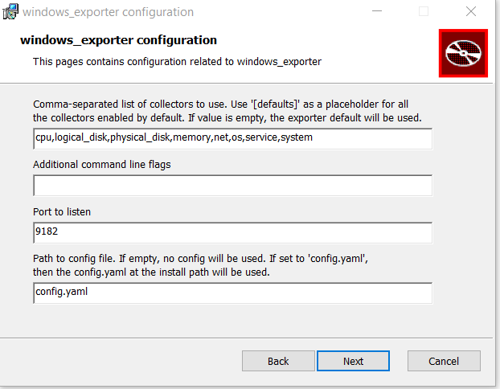

# download link
https://github.com/prometheus-community/windows_exporter/releases

# Installation
Télécharger le msi pour install permanente (le .exe c'est pour du one shot)
lancé le msi en saisissant la liste des "collectors" suivants:
"cpu,logical_disk,physical_disk,memory,net,os,service,system"

Prometheus doit pouvoir joindre l'hôte windows sur le port tcp 9182 (par défaut, ajustable dans le wizard du msi)